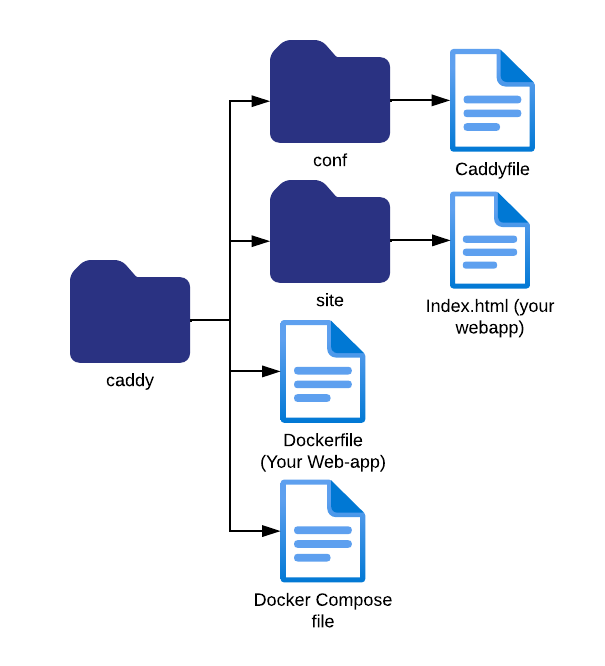
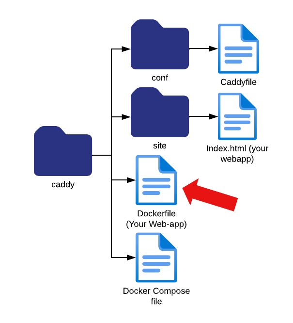

This will be the overall file sturcture for the project.

We assume you have or will make your own website or service, 
but for the purpose of demonstratrion we will provide a simple webserver in this tutorial.
This webserver will be running in its own docker container and is made out
of two parts, the `index.html` file, which is a super basic html file for a static webpage,
and the dockerfile that creates a docker image that we will run
through a docker compose file later in the tutorial.

If you are interested in the webserver and 
how it is built you can use the command:
`cat Dockerfile` to see how such a dockerfile looks.

In our small file structure this is where we place the dockerfile.

