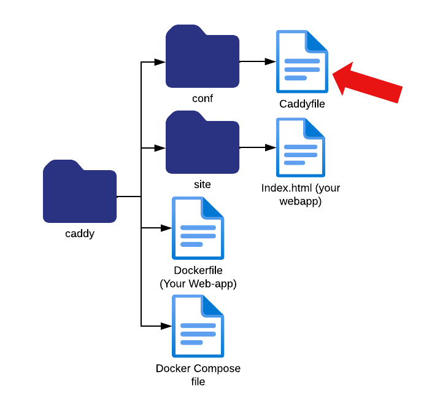

The next important step is to create the Caddyfile. 
First lets navigate to the conf folder, to do that run the command: `cd conf`.

We need to create the Caddyfile in the **current directory**. The Caddyfile is expected to be named **Caddyfile** (with a capital 'C' and no extension) by default. 

To create the Caddyfile use the command `touch Caddyfile`. This makes a new empty file named Caddyfile in your current directory. 
This file is the basic configuration file for the caddy web-server and will be used to set up things like reverse proxies, 
automatic HTTPS, and features such as **on-demand TLS**, which we will discuss in the next step.
